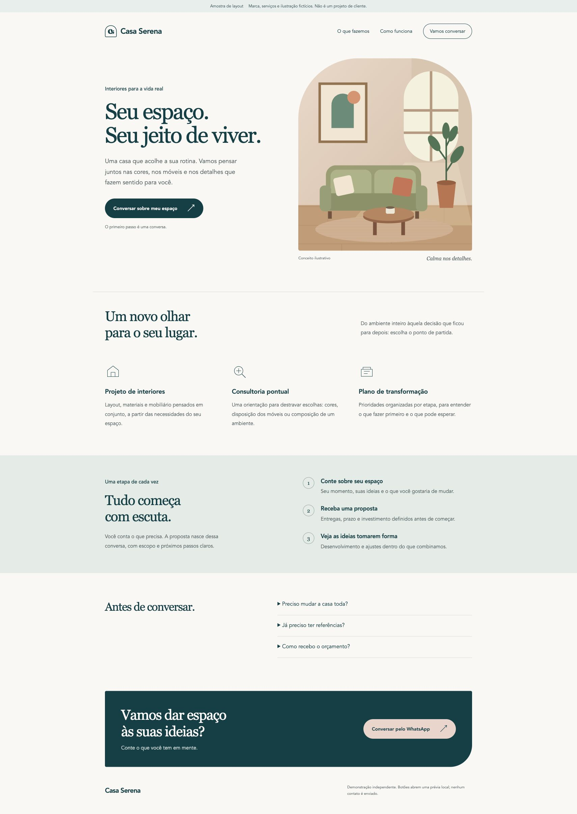
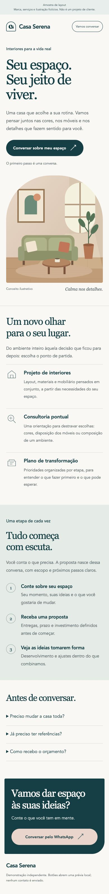

# Amostra de landing page

Casa Serena é uma marca fictícia usada para demonstrar uma página de serviços. A ilustração foi criada para esta amostra. Não representa cliente real ou trabalho contratado.

HTML, CSS e JavaScript sem dependências, com layout responsivo, navegação por seções, perguntas frequentes e prévia de contato. O conteúdo em português é ilustrativo.

## Prévia visual / Visual preview

Capturas reais da página executada localmente. Marca fictícia; estas imagens não representam um projeto de cliente nem uma página comercial publicada.

Actual screenshots of the locally running demonstration. Open an image to inspect it at full size.



<details>
<summary>Ver versão de celular / View mobile version (390 px)</summary>



</details>

## English overview

An original responsive landing-page demonstration for a fictional interiors brand. This is a self-directed sample, not a client case study. It uses plain HTML, CSS and JavaScript modules, with an original inline SVG illustration and no external fonts, tracking or packages.

To preview it, download the source, open a terminal in the extracted folder, run `python3 -m http.server 8847 --bind 127.0.0.1`, and visit `http://127.0.0.1:8847`. Run the contact-link tests with `node --test contact.test.mjs`.

Contact buttons open a demonstration dialog. No real phone number is configured and no messages are sent. The page was developed with AI assistance; commercial use requires the responsible person's review and the client's approved content and contact details.

## Abrir localmente

Na pasta extraída, execute:

```sh
python3 -m http.server 8847 --bind 127.0.0.1
```

Abra http://127.0.0.1:8847. O servidor local é necessário para carregar os módulos JavaScript; abrir o HTML diretamente pode bloquear esses módulos.

## Adaptar para um cliente

- `index.html`: conteúdo, ilustração, título e descrição.
- `style.css`: cores, tipografia e adaptação ao tamanho de tela.
- `config.mjs`: telefone internacional autorizado e mensagem inicial de WhatsApp.
- `app.mjs` e `contact.mjs`: comportamento do contato.

O telefone está vazio. Os botões abrem um aviso de demonstração e não enviam mensagens. Antes de publicar uma versão contratada, substituir a marca e os materiais fictícios, configurar o número autorizado, revisar os avisos de demonstração e a diretiva `noindex,nofollow`, e validar conteúdo e hospedagem com o cliente. Não inserir dados reais nesta amostra pública sem autorização.

## Validação realizada

Três testes automatizados da URL de WhatsApp passaram: destino ausente, codificação da mensagem e rejeição de formatos inválidos. Execute novamente com:

```sh
node --test contact.test.mjs
```

Layout inspecionado no navegador em desktop e celular; sem transbordamento horizontal nas larguras de 320 e 390 pixels. Abertura do aviso, fechamento com Escape, retorno de foco e abertura de pergunta frequente foram conferidos. Não houve envio real de WhatsApp, implantação de site público, auditoria completa de acessibilidade ou teste em todos os navegadores. O código pode ser consultado publicamente como amostra; isso não representa uma implantação comercial.

Página estática, sem dependências externas ou rastreamento. Desenvolvimento com assistência de IA e revisão humana pelo responsável antes de uso comercial.
